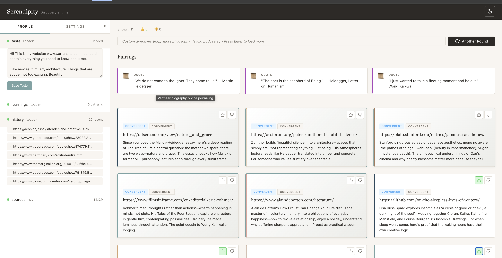

# Serendipity

A personal discovery engine to find content you'll love. Uses Claude for discovery, with an extensible configuration system for both your personal profile and the types of recommendations you want.



### 1. Extensible Context Sources

Context sources define what Claude knows about you. They can be:

- **Loaders**: Pull content from files (`taste.md`, `learnings.md`)
- **Commands**: Run shell commands to gather context
- **MCP servers**: Connect external knowledge bases (like Whorl)

Built-in sources:

- **taste.md**: Your aesthetic preferences, written in your own words
- **learnings.md**: Patterns extracted from your feedback over time
- **history**: What you've liked and disliked before

Add your own sources in `~/.serendipity/settings.yaml`.

### 2. Configurable Discovery Approaches

Approaches define _how_ Claude finds content. The defaults:

- **Convergent** ("More Like This"): Match your explicit interests directly
- **Divergent** ("Expand Your Palette"): Find content with shared underlying qualities, crossing genre boundaries

Add custom approaches by editing the `approaches` section in settings—each approach gets its own prompt hint that guides Claude's search strategy.

## Quick Start

```bash
# Install
pip install serendipity

# Set up your Anthropic API key
export ANTHROPIC_API_KEY="your-api-key"

# Open an editor to describe what you want
serendipity -i
```

Your first run opens an HTML page with recommendations. Click thumbs up/down to give feedback—Serendipity learns from it.

Set up your user profile for more customization:

```bash
serendipity profile -i
```

The root command passes through all discover flags. See `serendipity --help` for options, or `serendipity discover --help` for input methods (files, clipboard, stdin).

## Usage

```bash
# With taste profile set up
serendipity                             # Uses your profile

# Provide context
serendipity -i                          # Open editor
serendipity -p                          # From clipboard
serendipity discover notes.md           # From file
serendipity discover "contemplative"    # Quick prompt

# Options
serendipity -m opus                     # Use Claude Opus
serendipity -n 15                       # 15 recommendations
serendipity -s whorl                    # Enable Whorl MCP source
```

### 3. Pairings

Beyond recommendations, Serendipity can suggest contextual "pairings" that complement your discovery session—like wine pairings for a meal:

- **Music**: Background listening that matches your mood
- **Quote**: A thought-provoking quote related to themes
- **Exercise**: Physical activity suggestion
- **Food**: Something to eat/drink while exploring
- **Tip**: Practical advice related to your context

Enable/disable pairings in `settings.yaml`:

```yaml
pairings:
  music:
    enabled: true
    search_based: true  # Uses WebSearch
  quote:
    enabled: true
    search_based: false  # Generated from Claude's knowledge
```

### 4. Output Format & Destination

Output format (how recommendations are structured) and destination (where they go) are independent:

```bash
# Format options: html, markdown, json
serendipity -o html      # Rich HTML with cards (default)
serendipity -o markdown  # Plain text
serendipity -o json      # Structured data

# Destination options: browser, stdout, file
serendipity --dest browser   # Open in browser (default)
serendipity --dest stdout    # Print to terminal
serendipity --dest file      # Save to ~/.serendipity/output/
```

### 5. Piping Support

Serendipity auto-detects when output is piped and switches to JSON + stdout:

```bash
# Pipe to jq for filtering
serendipity | jq '.convergent[0].url'

# Save to file
serendipity > recommendations.json

# Chain with other tools
serendipity | jq -r '.convergent[].url' | xargs open
```

Explicit stdin input with `-`:

```bash
cat notes.md | serendipity discover -
echo "jazz music" | serendipity discover -
```

## Configuration

All settings live in `~/.serendipity/settings.yaml`:

```bash
serendipity settings                    # View all settings
serendipity settings --edit             # Edit in $EDITOR
serendipity settings get media.youtube  # View specific section
serendipity settings add media -i       # Add new media type
serendipity settings add approach -i    # Add new approach
serendipity settings add source -i      # Add new context source
```

## Advanced Options

See advanced options in [docs](./docs/)

## Tech Stack

**CLI**: Python, Typer, Rich

**Agent**: Claude (via claude-agent-sdk), WebSearch

**Output**: HTML with embedded feedback server

## Development

```bash
# Install dev dependencies
pip install -e ".[dev]"

# Run tests
pytest

# Lint
ruff check .
```

## Getting Your API Key

1. Go to [Anthropic Console](https://console.anthropic.com/)
2. Sign in or create an account
3. Navigate to API Keys
4. Create a new key and copy it
5. Set it:

   ```bash
   export ANTHROPIC_API_KEY="your-key"
   ```

   Or add to your shell profile (`~/.zshrc` or `~/.bashrc`).

## License

MIT
